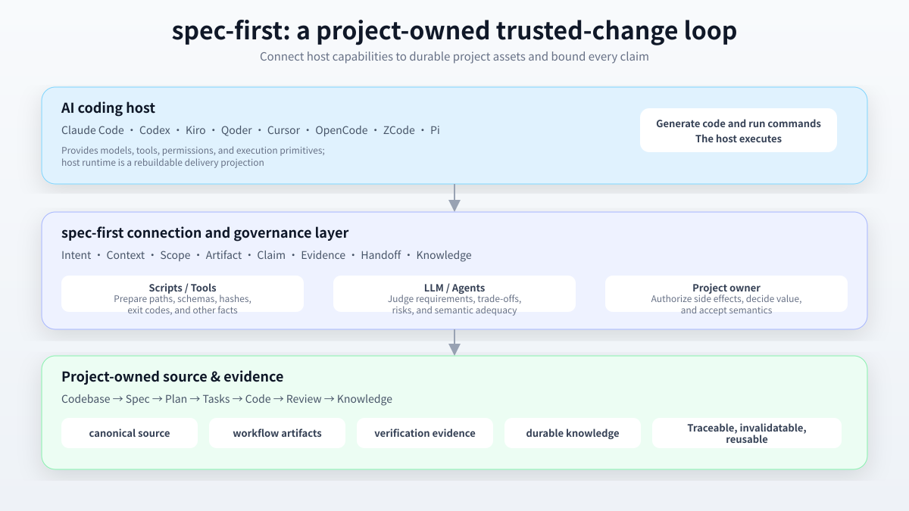

<div align="center">

# spec-first

**Turn AI coding sessions into trusted, project-owned changes.**

`spec-first` is a repository-native AI Coding Harness for Claude Code, Codex, Kiro, Qoder, Cursor, OpenCode, ZCode, and Pi. It connects intent, requirements, plans, code, review, evidence, and reusable knowledge in one inspectable engineering loop.

[](https://www.npmjs.com/package/spec-first)
[](https://github.com/sunrain520/spec-first/actions/workflows/npm-install-matrix.yml?query=branch%3Amaster)
[](https://github.com/sunrain520/spec-first/blob/master/package.json)
[](https://github.com/sunrain520/spec-first/blob/master/LICENSE)

[简体中文](README.md) | [English](README.en.md) | [User Manual](docs/05-用户手册/README.md) | [Website](http://spec-first.cn/)

</div>



```text
Intent → Spec → Plan → Tasks → Code → Review → Knowledge
```

## Why spec-first?

### Understand it in 30 seconds

AI coding hosts are good at generating and editing code, but a session can lose the intent, scope, trade-offs, verification evidence, and unresolved risks behind that code. `spec-first` keeps those artifacts inside the project and exposes the same `spec-*` workflow identities across supported hosts.

Three layers work together:

- **The host** provides the model, tools, permissions, and execution environment.
- **spec-first** connects intent, context, scope, artifacts, claims, evidence, and handoffs.
- **The project owner** decides value, authorizes side effects, and accepts the final semantics.

### What you get

| Outcome | Evidence visible in the project |
|---|---|
| Intent is preserved | Requirements and implementation plans in `docs/plans/` |
| Scope stays bounded | Plans, optional task packs, and source/runtime boundaries |
| Completion claims are grounded | Real commands, exit codes, logs, and verification summaries |
| Learning compounds | Reusable solutions in `docs/solutions/` with sources and invalidation conditions |

## Quick start

You need Node.js `>=20.0.0`, npm, Git, and at least one supported AI coding host. Run these commands from the root of the target Git repository.

### 1. Install and initialize

```bash
npm install -g spec-first
cd <your-repository>
spec-first quickstart
```

`quickstart` checks Node.js, Git, and installed host CLIs, then enters initialization. Restart the selected host. Restart Claude Code, Codex, or your selected host so it can discover the generated entries.

For scripted or explicit initialization:

```bash
spec-first doctor
spec-first init --codex -y -u <name> --lang <zh|en>
```

Initialization previews managed runtime files before writing and does not stage or commit them. See the [full quick start guide](docs/05-用户手册/01-快速开始.md) for multi-host, non-Git, dry-run, and preview-host usage.

### 2. Run your first workflow

Run workflow entries inside the host session; they are not shell subcommands:

```text
spec-brainstorm "Improve CLI onboarding for new users"
```

the workflow may legitimately skip writing a document; that is not a failure. This turns a rough idea into a reviewable requirements artifact, usually under:

```text
docs/plans/YYYY-MM-DD-NNN-<type>-<topic>-plan.md
```

Use `spec-plan` when the requirements are settled and `spec-work` when the plan is ready to execute. Run `spec-runtime-setup` before the first workflow when provider, MCP, or helper readiness needs checking.

## Choose the Right Workflow

### Choose an entrypoint by task

| Your situation | Start here | Main result |
|---|---|---|
| Compare several directions | `spec-ideate` | Ranked ideation record |
| Have a rough idea | `spec-brainstorm` | Requirements-only plan |
| Have a PRD that needs code-aware clarification | `spec-prd` | Planning-readiness artifact |
| Requirements are clear but implementation is not | `spec-plan` | Implementation-ready plan |
| Plan is settled and development can start | `spec-work` | Source changes and verification evidence |
| A test failed or behavior regressed | `spec-debug` | Root cause, fix, and evidence |
| Review a diff, branch, or PR | `spec-code-review` | Structured findings and risks |
| Preserve a verified reusable solution | `spec-compound` | Durable knowledge in `docs/solutions/` |

When you are unsure, let `using-spec-first` select one entrypoint from the current intent. This is a navigation map, not a mandatory state machine.

## From Prompt to Trusted Change

Rough idea -> spec-brainstorm --\
Existing PRD -> spec-prd ----------+-> spec-plan -> [spec-write-tasks] -> spec-work -> spec-code-review -> spec-compound

### A minimal end-to-end path

```text
Rough idea
  → spec-brainstorm
  → spec-plan
  → spec-work
  → spec-code-review
  → spec-compound (when the learning qualifies)
```

For example:

```text
spec-brainstorm "Add configuration import to the CLI"
# review the requirements-only plan in docs/plans/
spec-plan <plan-path>
# execute the implementation-ready plan
spec-work <plan-path>
```

Each workflow states whether it creates an artifact, changes source, and what verification it requires. Treat claims as no stronger than their direct evidence.

## What Stays in the Repository

### What the project keeps

```text
docs/
  ideation/      Direction exploration from spec-ideate
  brainstorms/   Clarification artifacts from spec-prd
  plans/         Requirements-only and implementation-ready plans
  tasks/         Optional task packs derived from plans
  solutions/     Verified, reusable engineering knowledge
  validation/    Test, review, and field-validation evidence
.spec-first/
  workflows/     Conditional verification evidence (gitignored by default)
```

Artifacts prove only the claims covered by their direct evidence. Host runtime assets are rebuildable delivery projections, not canonical source. Change `skills/`, `templates/`, `src/cli/`, and checked-in docs first, then refresh projections with `spec-first init`.

## How trust is established

The division is simple: **scripts prepare facts, LLMs make semantic judgments, and project owners authorize side effects.**

- Completion claims cannot exceed the evidence that directly supports them.
- Mutation, verification, handoff, source/runtime, and knowledge exits have explicit boundaries.
- Providers and historical artifacts are advisory inputs with provenance, freshness, and limitations until confirmed against source evidence.
- Long-running or high-impact work needs scope, checkpoints, stop conditions, recovery points, and independent verification.

See the [project role contract](docs/10-prompt/结构化项目角色契约.md), [source/runtime boundary](docs/contracts/source-runtime-customization-boundary.md), [verification summary contract](docs/contracts/verification/verification-run-summary.md), and [honest closeout contract](docs/contracts/workflows/honest-closeout.md).

## How Trust Works

## Host Support

| Host | Current guidance | Initialization |
|---|---|---|
| Claude Code | Primary support; recommended starting point | `--claude` |
| Codex | Primary support; recommended starting point | `--codex` |
| Kiro | Opt-in preview | `--kiro` |
| Qoder | Opt-in preview | `--qoder` |
| Cursor | Generated-runtime preview | `--cursor` |
| OpenCode | Generated-runtime preview | `--opencode` |
| ZCode | Opt-in preview; some capabilities live-verified | `--zcode` |
| Pi | Opt-in preview; some capabilities live-verified | `--pi` |

generated_runtime_preview. generated_runtime_preview. Generated runtime, host discovery, and real workflow verification are separate claims. Run `spec-first doctor --verbose` for project facts; see the [Runtime Capability Catalog](docs/catalog/runtime-capabilities.md) for detailed status.

## When It Fits

## When to use it

`spec-first` fits teams that already use AI coding hosts and need to preserve intent across sessions or hosts, keep review and verification evidence, and return qualified learning to the project.

It is usually unnecessary when you only want a one-off prompt, cannot store workflow artifacts in the repository, need a standalone IDE, or expect a central engine to decide product priorities and architecture for you.

## Documentation

- [User Manual](https://github.com/sunrain520/spec-first/blob/master/docs/05-%E7%94%A8%E6%88%B7%E6%88%B7%E6%89%8B%E5%86%8C/README.md)
- [Runtime Capability Catalog](https://github.com/sunrain520/spec-first/blob/master/docs/catalog/runtime-capabilities.md)

## CLI Reference

```bash
spec-first quickstart  # check prerequisites and enter init
spec-first doctor      # inspect environment and runtime health
spec-first init        # generate runtime assets for selected hosts
spec-first update      # upgrade the CLI and refresh runtime assets
spec-first clean       # remove managed generated assets
spec-first plans audit --status completed --json
```

Run `spec-first --help` for all options.

## Development & Contributing

```bash
npm run typecheck
npm run test:unit
npm run test:smoke
npm run test:integration
npm run test:release
npm run build
```

Make source changes in canonical source surfaces. Regenerate runtime copies with `spec-first init` only when the runtime source changes. See the [contribution guide](CONTRIBUTING.md), [security policy](SECURITY.md), [changelog](CHANGELOG.md), and [GitHub Issues](https://github.com/leo-kuang-ai/spec-first/issues).

MIT licensed.

## Community

- [GitHub Issues](https://github.com/sunrain520/spec-first/issues)
- [Website](http://spec-first.cn/)
