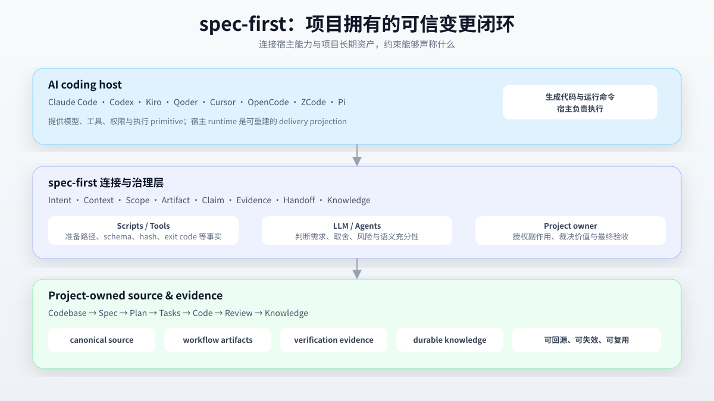

<div align="center">

# spec-first

**把 AI coding 会话变成可信、由项目拥有的变更。**

`spec-first` 是面向 Claude Code、Codex、Kiro、Qoder、Cursor、OpenCode、ZCode 与 Pi 的仓库原生 AI Coding Harness。它把想法、需求、计划、代码、审查和知识连接成可检查的工程闭环。

[](https://www.npmjs.com/package/spec-first)
[](https://www.npmjs.com/package/spec-first)
[](https://github.com/sunrain520/spec-first/actions/workflows/npm-install-matrix.yml?query=branch%3Amaster)
[](https://github.com/sunrain520/spec-first/blob/master/package.json)
[](https://github.com/sunrain520/spec-first/blob/master/LICENSE)

[English](README.en.md) | [简体中文](README.md) | [用户手册](docs/05-用户手册/README.md) | [官方网站](http://spec-first.cn/)

</div>



```text
Intent → Spec → Plan → Tasks → Code → Review → Knowledge
```

## 为什么使用 spec-first？

### 30 秒理解

AI coding 宿主擅长生成和修改代码，但一次会话结束后，意图、范围、取舍、验证证据和未决风险很容易丢失。`spec-first` 将这些内容保留在项目边界内，并让不同宿主可以消费同一套 `spec-*` workflow 入口。

你可以把它理解为三层协作：

- **宿主**负责模型、工具、权限和代码执行。
- **spec-first**负责连接 intent、context、scope、artifact、claim、evidence 和 handoff。
- **项目 owner**负责价值判断、授权副作用和最终语义验收。

### 你会得到什么

| 结果 | 项目中可见的证据 |
|---|---|
| 意图被保存 | `docs/plans/` 中的需求或实施计划 |
| 执行范围可控 | plan、可选 task pack、source/runtime 边界 |
| 完成声明有依据 | 真实命令、exit code、日志和 verification summary |
| 经验可以复用 | `docs/solutions/` 中带来源和失效条件的知识 |

## 快速开始

需要 Node.js `>=20.0.0`、npm、Git，以及至少一个受支持的 AI coding 宿主。以下命令在目标 Git 仓库根目录执行。

### 1. 安装并初始化

```bash
npm install -g spec-first
cd <your-repository>
spec-first quickstart
```

`quickstart` 会检查 Node.js、Git 和已安装的宿主 CLI，并进入初始化流程。选择宿主后，重启已选择的宿主（Restart the selected host）。重启 Claude Code、Codex 或其他目标宿主，使其发现生成的入口。

需要脚本化或显式指定宿主时：

```bash
spec-first doctor
spec-first init --codex -y -u <name> --lang <zh|en>
```

初始化会在写入前预览受管 runtime 文件；它不会自动 stage 或提交文件。多宿主、非 Git 目录、dry-run 和 preview 宿主用法见[完整快速开始指南](docs/05-用户手册/01-快速开始.md)。

### 2. 首次运行 workflow

在宿主会话中运行（这些不是 shell 子命令）：

```text
spec-brainstorm "改进 CLI 新用户 onboarding"
```

这会把模糊想法收敛为可审查的 requirements artifact，通常位于：

```text
docs/plans/YYYY-MM-DD-NNN-<type>-<topic>-plan.md
```

如果需求已经明确，可直接使用 `spec-plan`；准备执行时使用 `spec-work`。首次 workflow 前需要检查 provider、MCP 或 helper readiness 时，运行：

```text
spec-runtime-setup
```

## 选择合适的 Workflow

### 按任务选择入口

| 你的情况 | 从这里开始 | 主要结果 |
|---|---|---|
| 想比较多个方向 | `spec-ideate` | 排序后的方向记录 |
| 只有一个模糊想法 | `spec-brainstorm` | requirements-only plan |
| 已有 PRD，需要结合代码澄清 | `spec-prd` | planning-readiness artifact |
| 需求确定，但实现方式未定 | `spec-plan` | implementation-ready plan |
| 计划已确定，准备开发 | `spec-work` | 源码变更与验证证据 |
| 测试失败、回归或异常 | `spec-debug` | 根因、修复与验证证据 |
| 审查 diff、分支或 PR | `spec-code-review` | 结构化 findings 与风险 |
| 保存已验证的可复用经验 | `spec-compound` | `docs/solutions/` 知识 |

不确定从哪里开始时，让 `using-spec-first` 根据当前意图选择一个入口。这张地图是导航，不是强制状态机；task pack、文档审查和浏览器验证按任务需要加入。

## 从 Prompt 到可信变更

粗略想法 -> spec-brainstorm --\
已有 PRD -> spec-prd ----------+-> spec-plan -> [spec-write-tasks] -> spec-work -> spec-code-review -> spec-compound

### 一个完整的最小路径

```text
粗略想法
  → spec-brainstorm
  → spec-plan
  → spec-work
  → spec-code-review
  → spec-compound（有合格经验时）
```

例如：

```text
spec-brainstorm "为 CLI 增加配置导入"
# 审查 docs/plans/ 中的 requirements-only plan
spec-plan <plan-path>
# 执行 implementation-ready plan
spec-work <plan-path>
```

每个 workflow 都会说明它是否创建 artifact、是否修改源码以及需要哪些验证。不要把“模型说已完成”当作现场结果；以可回源的命令、日志、测试或 owner evidence 为准。

## 仓库会留下什么

### 项目会留下什么

```text
docs/
  ideation/      spec-ideate 的方向探索
  brainstorms/   spec-prd 的澄清产物
  plans/         requirements-only 与 implementation-ready plans
  tasks/         从 plan 派生的可选 task packs
  solutions/     已验证且可复用的工程经验
  validation/    测试、审查和现场验证证据
.spec-first/
  workflows/     条件式验证证据（默认 gitignore）
```

这些目录中的 artifact 只证明其直接证据覆盖的 claim。宿主 runtime assets 是可重建的 delivery projection，不是 canonical source；行为修改应回到 `skills/`、`templates/`、`src/cli/` 和 checked-in docs，再用 `spec-first init` 刷新投影。

## 信任如何建立

`spec-first` 遵循一条简单分工：**脚本准备事实，LLM 做语义判断，项目 owner 授权副作用。**

- 完成声明的范围不能超过证据直接支持的范围。
- mutation、verification、handoff、source/runtime 和 knowledge 出口有明确边界。
- provider 和历史 artifact 默认是带 provenance、freshness 与 limitation 的 advisory input，进入结论前需要回源确认。
- 长时或高影响工作需要 scope、checkpoint、停止条件、恢复点和独立验证。

完整原则见[项目角色契约](docs/10-prompt/结构化项目角色契约.md)、[Source/Runtime 边界](docs/contracts/source-runtime-customization-boundary.md)、[Verification Summary 合同](docs/contracts/verification/verification-run-summary.md)和 [Honest Closeout 合同](docs/contracts/workflows/honest-closeout.md)。

## 宿主支持

| 宿主 | 当前建议 | 初始化 |
|---|---|---|
| Claude Code | 主要支持，推荐起点 | `--claude` |
| Codex | 主要支持，推荐起点 | `--codex` |
| Kiro | opt-in preview | `--kiro` |
| Qoder | opt-in preview | `--qoder` |
| Cursor | generated runtime preview | `--cursor` |
| OpenCode | generated runtime preview | `--opencode` |
| ZCode | opt-in preview，部分能力已有实机验证 | `--zcode` |
| Pi | opt-in preview，部分能力已有实机验证 | `--pi` |

生成 runtime、宿主发现入口和真实 workflow 验证是不同层次。运行 `spec-first doctor --verbose` 查看当前项目事实；详细状态以[Runtime Capability Catalog](docs/catalog/runtime-capabilities.md)为准。

## 适用边界

适合以下团队：

- 已经使用 AI coding 宿主；
- 需要跨会话或跨宿主保留意图和交接；
- 需要计划、review 和验证证据；
- 希望将合格经验沉淀回项目。

以下情况通常不需要它：

- 只想复制一次性 prompt；
- 不允许仓库保存 workflow artifact；
- 需要独立 IDE 或中心化流程引擎；
- 希望工具替项目 owner 决定产品优先级和架构。

## CLI 参考

```bash
spec-first quickstart  # 检查前置条件并进入 init
spec-first doctor      # 检查环境和 runtime 健康状态
spec-first init        # 生成所选宿主的 runtime assets
spec-first update      # 升级 CLI 并刷新 runtime assets
spec-first clean       # 移除所选 generated runtime assets
spec-first plans audit --status completed --json
```

运行 `spec-first --help` 查看全部选项。

## 开发与贡献

```bash
npm run typecheck
npm run test:unit
npm run test:smoke
npm run test:integration
npm run test:release
npm run build
```

源码变更应发生在 canonical source surfaces。只有 runtime source 变化时，才通过 `spec-first init` 重新生成 runtime copies。更多信息见[贡献指南](CONTRIBUTING.md)、[安全策略](SECURITY.md)、[版本记录](CHANGELOG.md)和 [GitHub Issues](https://github.com/sunrain520/spec-first/issues)。

项目使用 MIT License。

## 相关文档

- [用户手册](https://github.com/sunrain520/spec-first/blob/master/docs/05-%E7%94%A8%E6%88%B7%E6%89%8B%E5%86%8C/README.md)
- [Runtime Capability Catalog](https://github.com/sunrain520/spec-first/blob/master/docs/catalog/runtime-capabilities.md)
- [项目角色契约](https://github.com/sunrain520/spec-first/blob/master/docs/10-prompt/%E7%BB%93%E6%9E%84%E5%8C%96%E9%A1%B9%E7%9B%AE%E8%A7%92%E8%89%B2%E5%A5%91%E7%BA%A6.md)

## 加入社区

- [GitHub Issues](https://github.com/sunrain520/spec-first/issues)
- [官方网站](http://spec-first.cn/)
